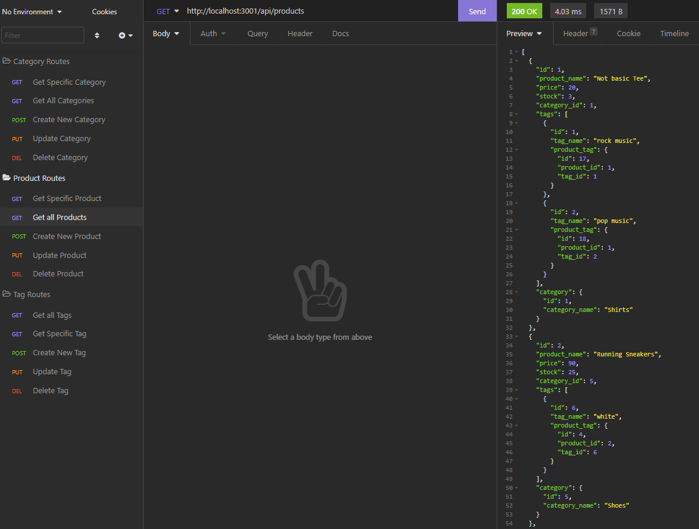

# E-Commerce Backend

[](https://opensource.org/licenses/MIT)

This is the backend of an e-commerce website consisting of a database with categories, tags and products and a routing API built with express.js. There is no front end for this application, instead, the user is expected to use Insomnia to test out the routes constructed.

## Getting Started

* First, make sure you have a terminal viewer installed (such as Git Bash).
* Next, install [Node.js](https://nodejs.org/).
* Then, install [MySQL](https://www.mysql.com/) and follow their instructions VERY carefully.
* Then, install [Insomnia](https://insomnia.rest/) which will be used to test the routes
* type in `mysql -u root -p`
* Enter the password as `password`
* Run `source schema.sql` in the command line
* Open a NEW terminal and navigate to the root folder
* Run `npm install` and wait for node_modules to finish installing
* Change the .env.EXAMPLE to .env and update the DB_USER to `root` and DB_PW to `password`
* (optional) run `npm run seed` to seed the database with example data
* Run `node server.js`
* Open Insomnia to test the routes!


## Deployed Link

* N/A (see Getting Started section)

## Demo

[Demo video showing insomnia testing routes](https://watch.screencastify.com/v/AURDGYnKx6E7QS97eR7R)

## Screenshot



## Code snippet

This snipped demonstrates the code behind the GET route of root:/api/products route. It returns all the products along with their associated categories and tags

```
router.get('/', async (req, res) => {
  try {
    const productData = await Product.findAll({
      include: [
        { model: Tag, through: ProductTag, as: 'tags' }, 
        { model: Category }
      ],
    });
    const products = productData.map((product) => product.get({plain: true}));
    res.status(200).json(products);
  } catch (err) {
    res.status(500).json(err);
  }
});

```

## Built With

* [Javascript](https://developer.mozilla.org/en-US/docs/Web/JavaScript)
* [Node.js](https://nodejs.org/)
* [MySQL2 package](https://www.npmjs.com/package/mysql2)
* [Insomnia](https://insomnia.rest/)
* [Sequelize](https://sequelize.org/)


## Authors

* **Emily Dorgan** 

- [Link to Portfolio Site](https://emdorgan.github.io/updated-portfolio/)
- [Link to Github](https://github.com/emdorgan)
- [Link to LinkedIn](https://www.linkedin.com/in/emily-dorgan/)

## License

This project is licensed under the [MIT License](https://opensource.org/licenses/MIT)